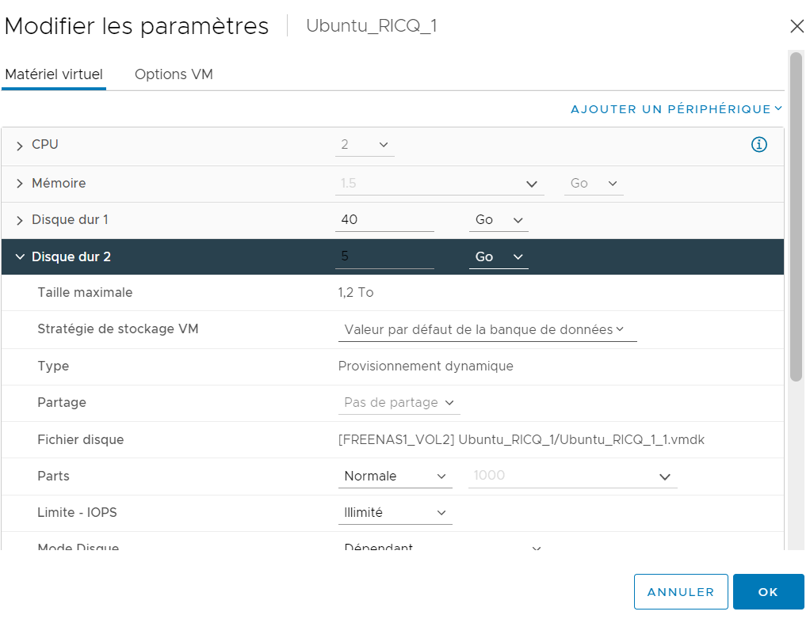
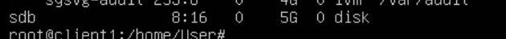
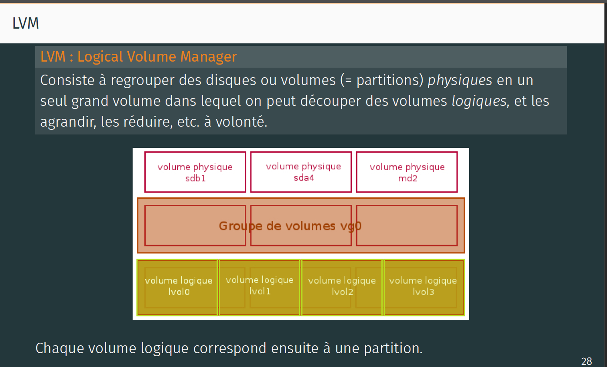
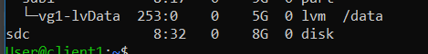

[TP5 :]{.ul}

# Table des matières {#table-des-matières .TOC-Heading}

[Exercice 1. Disques et partitions :
2](#exercice-1.-disques-et-partitions)

[Exercice 2. Partitionnement LVM : 4](#exercice-2.-partitionnement-lvm)

# Exercice 1. Disques et partitions :

{width="6.268055555555556in"
height="2.9243055555555557in"}

[Question1 :]{.ul}
{width="6.268055555555556in"
height="4.795833333333333in"}

[Question2 :]{.ul} On peut le vérifier avec la commande
**lsblk** :{width="6.268055555555556in"
height="0.4875in"}

[Question3 :]{.ul} Nous allons partitionner le nouveau disque avec la
commande **fdisk** :

-   fdisk /dev/sdb

    -   n =\> nouvelle partition primare de 2Go

    -   t =\> changer le type pour Linux (83)

    -   n =\> nouvelle partition extend de 3Go

    -   t =\> changer le type pour ntfs (7)

{width="5.427841207349081in"
height="0.739686132983377in"}

[Question4 :]{.ul} Nous allons formater les partitions avec la commande
**mkfs** :

-   sudo mkfs -t ext4 /dev/sdb1

-   sudo mkfs -t ntfs /dev/sdb2

[Question5 :]{.ul} La commande ne fonctionne pas car le système de
fichier n'est pas monté.

[Question6 :]{.ul} Il nous faut tout d'abord créer les dossiers où vont
êtres montés nos points de montages ( mkdir win et pas pour data car il
existe déjà, de plus ils faut les créer à la racine). Puis dans le
fichier fstab, nous allons renseigner les lignes sivantes :

-   /dev/sdb1 /data ext4 defaults 0 2

-   /dev/sdb2 /win ntfs defaults 0 2

[Question7 :]{.ul} Pour monter notre point de montage nous allons
utiliser la commande mount :

-   Sudo mount -a /dev/sdb1 /data

-   Sudo mount -a /dev/sdb2 /win

[Question 9 :]{.ul} sudo apt install virtualbox-guest-additions-iso

# Exercice 2. Partitionnement LVM :

[Question 1 :]{.ul} Nous allons démonter les points de montages que nous
avons mis en place lors de l'exercice , avec la commande : **umount
nom_point-de-montage**

Puis nous allons supprimer les lignes correspondantes dans le fichier
fstabe :

-   **sudo umount /data**

-   **sudo umount /win**

[Question 2 :]{.ul} Pour supprimer les 2 partitions du disk sdb nous
allons utiliser fdisk :

-   fdisk /dev/sdb

    -   d =\> supprimer les partition

    -   n =\> nouvelle partition primare et unique de 5Go

    -   t =\> changer le type pour LVM Linux (8^e^)

Petit Rappel :
{width="6.268055555555556in"
height="3.798611111111111in"}

{width="6.268055555555556in"
height="3.845833333333333in"}

[Question 3 :]{.ul} La commande pvcreate permet de créer un volume
physique LVM.

-   Sudo pvcreate /dev/sdb1

-   Pvdisplay =\> permet d'afficher les OOOOOOOOOOOO.

[Question 4 :]{.ul} La commande vgcreate permet de créer un groupe de
volumes. Le groupe de volumes pourra contenir les volumes physiques au
format LVM (possible grâce à la commande pvcreate). Ici notre groupe de
volume va être nommé vg1.

-   Sudo vgcreate vg1 /dev/sdb1

-   Vgdisplay =\> OOOOOOOOOOOOOO.

[Question 5 :]{.ul} La commande lvcreate permet de créer les volumes
logiques. Ici notre volume logique va être nommé lvData et ce dernier va
occuper l'intégralité de l'espace disque disponible.

-   Sudo lvcreate -n lvData -l 100%FREE vg1

[Question 6 :]{.ul} Nous allons créer une partition en ext4 dans notre
volume logique lvData :

-   Sudo mkfs -t ext4 /dev/vg1/lvData

> On va ensuite rentrer la ligne correspondante dans le fichier fstab :
>
> **/dev/vg1/lvData /data ext4 defaults 0 2**
>
> [Question 7 :]{.ul} Nous allons ajouter un disque de 8Go à notre VM
> (ATTENTION à bien éteindre la machine avant de le faire) : {width="6.268055555555556in"
> height="5.0465277777777775in"}
>
> {width="4.885416666666667in"
> height="0.625in"}

Ensuite nous allons le configurer comme dans la question 2 et 3 :

-   fdisk /dev/sdc

    -   d =\> supprimer les partition

    -   n =\> nouvelle partition primaire et unique de 5Go

    -   t =\> changer le type pour LVM Linux (8^e^)

-   sudo pvcreate /dev/sdc1

[Question 8 :]{.ul} La commande vgextend permet d'ajouter un nouveau
disque au groupe de volume (vg1) :

-   sudo vgextend vg1 /dev/sdc1

[Question 9 :]{.ul} La commande **lvresize** permet d'augmenter la
taille d'un volume logique et la commande **resize2fs** permet de
redimensionner le système de fichier.

Petit Rappel : Un système de fichiers (SF) décrit la manière dont les
données sont organisées à l'intérieur d'une partition. Il fait
l'interface entre l'utilisateur (applications) et le pilote d'E/S du
matériel.

-   sudo lvresize -l +100%FREE /dev/vg1/lvData

-   sudo resize2fs /dev/vg1/lvData
